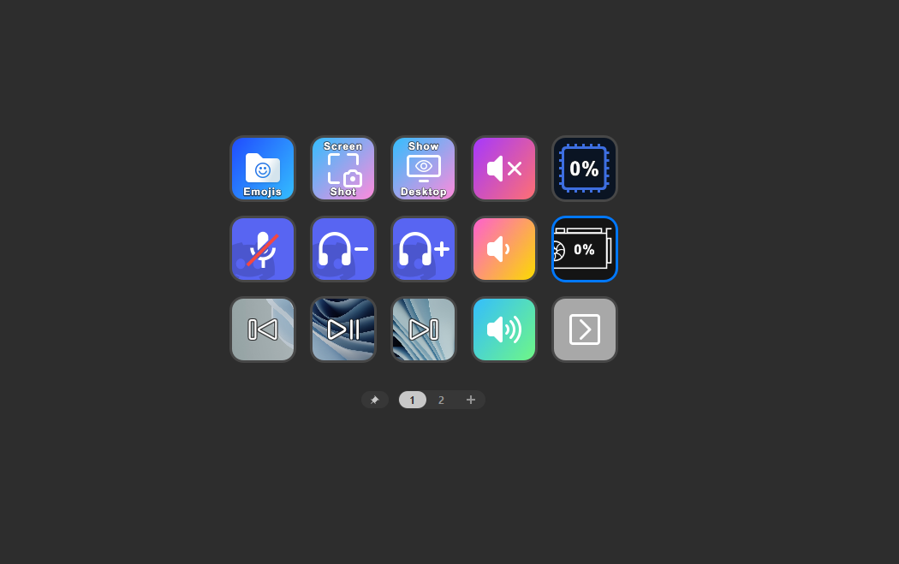

# Stream Deck GPU Utilization Plugin 📈

A plugin for monitoring the utilization of your GPU on the Elgato Stream Deck. Windows only.

Built for both NVIDIA and AMD video cards, but currently only
tested on an NVIDIA GeForce RTX 4080. AMD testers are needed!

# Dependencies

* Stream Deck C++ SDK (must use C++ 20 or above)
* NVIDIA CUDA Toolkit
* DirectX

# Installation

Download the latest sdPlugin file from the Releases link on GitHub, and double-click it to install.

# Building

_I used CLion with CMake 3.26, but you are welcome to use Visual Studio 2022 if required._

First, clone the repo as follows:

`
git clone --recurse-submodules https://github.com/thompsonnoahe/StreamDeckGpu.git
`

Then, download the NVIDIA CUDA Toolkit 12 from [NVIDIA's website](https://developer.nvidia.com/cuda-toolkit).

And presto! You should be good to go.

